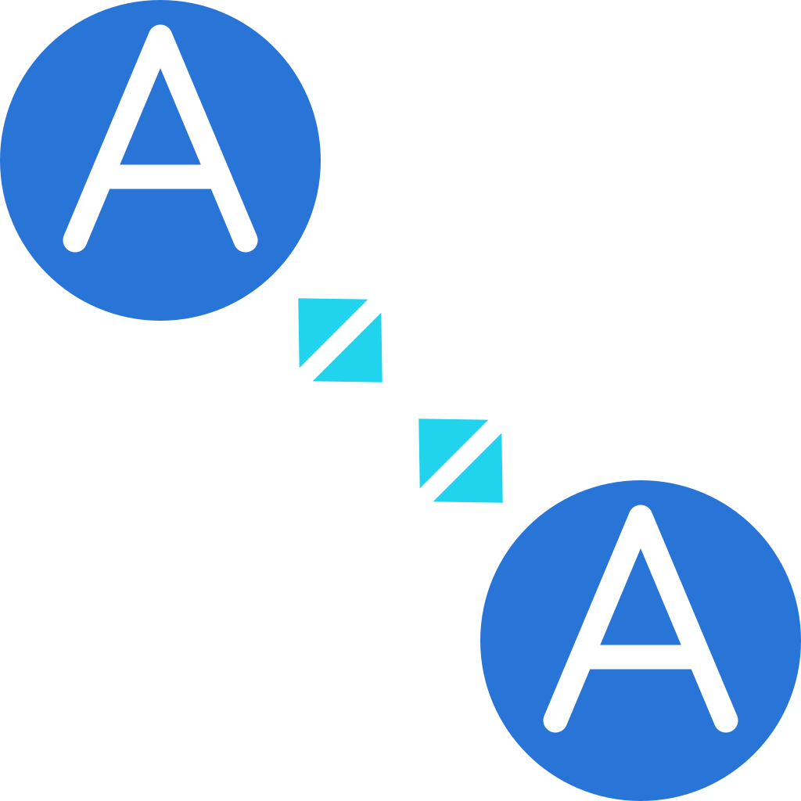

<p align="center">
  
</p>

<h1 align="center">A2A Events</h1>

<p align="center">
  AgentCard-native durable event subscriptions for the
  <a href="https://a2a-protocol.org">A2A protocol</a>.<br>
  <strong>Subscribe to agents, not URLs.</strong>
</p>

A2A Events lets one A2A agent subscribe to another agent's future events using
AgentCard discovery, explicit topics, selectors, leases, durable cursors,
acknowledgements, replay, and signed delivery. It is an A2A *extension*
(`https://example.com/a2a-events/extensions/events/v1`), built strictly on A2A v1.0
primitives.

This repository is the **language-neutral source of truth** for the protocol —
the spec, schemas, conformance vectors, and docs. The reference implementation
lives in a separate repo:

- **Python implementation & reference runtime:**
  [`a2a-events-python`](https://github.com/a2a-events/a2a-events-python)

## Start here

- **New here? Read the [docs/](docs) — [Introduction](docs/introduction.md),
  [Protocol Guide](docs/protocol-guide.md), [Getting Started](docs/getting-started.md).**
- Design spec: [`DESIGN.md`](DESIGN.md)
- Scaling & operating a publisher: [`docs/scaling.md`](docs/scaling.md)
- JSON Schemas (the published contract, generated from the models): [`schemas/`](schemas)
- Conformance vectors: [`conformance/`](conformance)
- A2A reference snapshot: [`docs/a2a-reference.md`](docs/a2a-reference.md)
- Prior-art / positioning: [`docs/prior-art.md`](docs/prior-art.md)

> Status: early implementation, expanding past the initial v0.1 slice.

## Repository layout

The project is split into two repositories that stay independent but reference
each other (see [§27 of the design](DESIGN.md#27-repository-strategy)):

```
a2a-events/          # this repo — language-neutral source of truth
  DESIGN.md          #   normative spec
  schemas/           #   published JSON Schemas (the contract)
  conformance/       #   conformance fixtures + coverage
  docs/              #   intro docs
  tests/             #   cross-language conformance runner (stub)

a2a-events-python/   # the Python implementation (separate repo)
```

The Python repo *vendors* a copy of `schemas/` and `conformance/fixtures/` from
here (kept current with its `scripts/sync_spec.py`) so it stays self-contained,
while this repo remains authoritative.

## What's in the protocol

- **Canonical JSON-RPC surface** — the `a2a.events.*` methods (`ListTopics`,
  `Subscribe`, `GetSubscription`, `ListSubscriptions`, `RenewSubscription`,
  `DeleteSubscription`, `Replay`, `Ack`, `ListDeliveryAttempts`) with opaque
  keyset cursors, plus an optional 1:1 HTTP+JSON binding and a gRPC binding.
- **AgentCard discovery & trust** (§12.2, §21.2) — subscribers are resolved from
  their real A2A AgentCard; delivery endpoints come **only** from the card, under
  a configurable trust policy (HTTPS-only, same-origin, allowlist, AgentCard
  signature verification, domain-ownership challenge).
- **Durable subscriptions** — explicit topics, the normative selector algebra
  (§10.4), leases with renewal, opaque per-topic cursors, replay, and
  at-least-once delivery with explicit/implicit ack.
- **Signed delivery** — Ed25519 (EdDSA) over the RFC 8785 (JCS) canonical event,
  with signing-key rotation via JWKS.
- **Security model** — control-plane authentication and topic authorization
  evaluated at both subscribe and delivery time, per-subscription delivery
  tokens, SSRF guards, and timestamp-skew rejection.
- **Operability** — retention compaction (§31), a durable retry architecture
  (§19.4), and an observability/metrics model (§32).

See [`DESIGN.md`](DESIGN.md) for the normative details and the [docs](docs) for a
guided tour. The
[`a2a-events-python`](https://github.com/a2a-events/a2a-events-python) repo
implements all of the above and is the place to run code.

## License

MIT — see [`LICENSE`](LICENSE).
