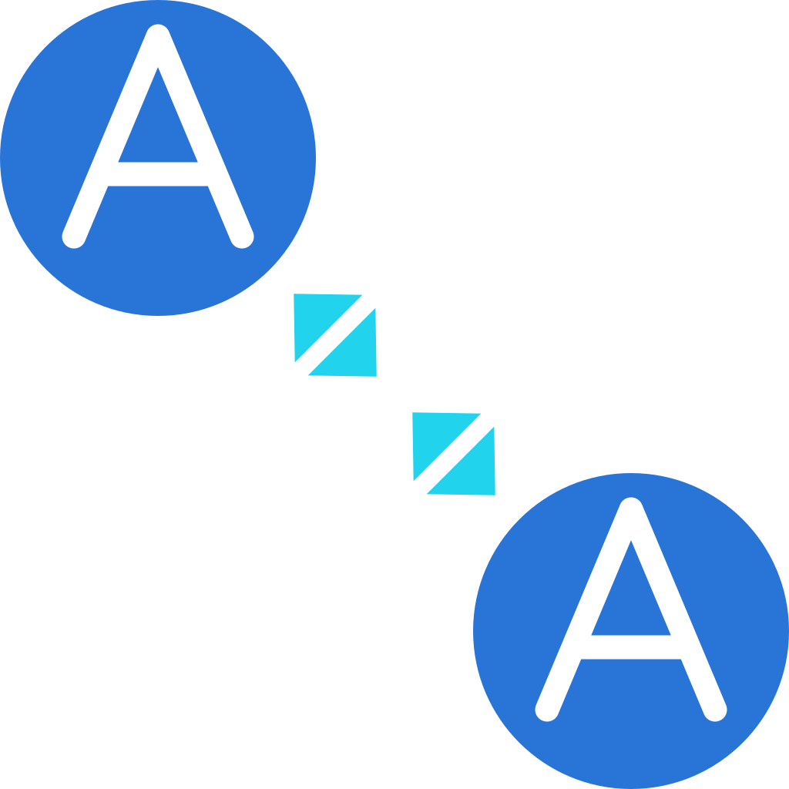

---
hide:
  - navigation
  - toc
---

  

    
    <h1>A2A Events</h1>
  

  

    Durable, AgentCard-native event subscriptions between A2A agents —
    subscribe to agents, not URLs.
  

  

    <a class="md-button md-button--primary" href="getting-started/">Get started</a>
    <a class="md-button" href="specification/">Read the spec</a>
  

## What is A2A Events?

A2A Events is an A2A *extension*
(`https://example.com/a2a-events/extensions/events/v1`), built strictly on A2A
v1.0 primitives. A subscriber discovers a publisher through its real AgentCard
and subscribes to the agent — the publisher resolves delivery endpoints only
from that card. It adds explicit topics, a normative selector algebra, leases,
opaque durable cursors, replay, and signed at-least-once delivery.

This site is the language-neutral source of truth: the
[specification](specification.md), JSON Schemas, conformance vectors, and guides.
The Python reference implementation lives in
[`a2a-events-python`](https://github.com/a2a-events/a2a-events-python).

## Start here

-   :material-book-open-variant:{ .lg .middle } **Introduction**

    ---

    What A2A Events is, the problem it solves, the "subscribe to agents, not
    URLs" model, and how it relates to A2A core.

    [:octicons-arrow-right-24: Introduction](introduction.md)

-   :material-map-legend:{ .lg .middle } **Protocol Guide**

    ---

    A wire-level tour: discovery, the subscription lifecycle, topics &
    selectors, cursors, the event envelope, delivery, ack/replay, and the
    method surface.

    [:octicons-arrow-right-24: Protocol Guide](protocol-guide.md)

-   :material-rocket-launch:{ .lg .middle } **Getting Started**

    ---

    Run the full flow in code: in-memory first, then over HTTP, then across
    containers.

    [:octicons-arrow-right-24: Getting Started](getting-started.md)

-   :material-file-document-outline:{ .lg .middle } **Specification**

    ---

    The complete normative spec — the JSON-RPC surface, selector algebra,
    security model, delivery semantics, and error model.

    [:octicons-arrow-right-24: Specification](specification.md)

## What's in the protocol

- **Canonical JSON-RPC surface** — the `a2a.events.*` methods (`ListTopics`,
  `Subscribe`, `GetSubscription`, `ListSubscriptions`, `RenewSubscription`,
  `DeleteSubscription`, `Replay`, `Ack`, `ListDeliveryAttempts`) with opaque
  keyset cursors, plus an optional 1:1 HTTP+JSON binding and a gRPC binding.
- **AgentCard discovery & trust** — subscribers are resolved from their real A2A
  AgentCard; delivery endpoints come **only** from the card, under a configurable
  trust policy (HTTPS-only, same-origin, allowlist, AgentCard signature
  verification, domain-ownership challenge).
- **Durable subscriptions** — explicit topics, the normative selector algebra,
  leases with renewal, opaque per-topic cursors, replay, and at-least-once
  delivery with explicit/implicit ack.
- **Signed delivery** — Ed25519 (EdDSA) over the RFC 8785 (JCS) canonical event,
  with signing-key rotation via JWKS.
- **Security model** — control-plane authentication and topic authorization
  evaluated at both subscribe and delivery time, per-subscription delivery
  tokens, SSRF guards, and timestamp-skew rejection.
- **Operability** — retention compaction, a durable retry architecture, and an
  observability/metrics model.

See the [specification](specification.md) for the normative details and the
[Protocol Guide](protocol-guide.md) for a guided tour. The
[`a2a-events-python`](https://github.com/a2a-events/a2a-events-python) repo
implements all of the above and is the place to run code.
